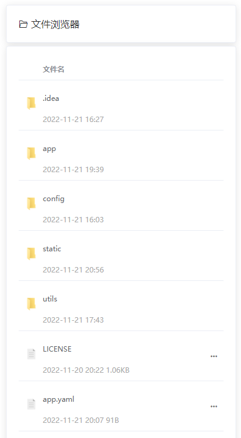

# 网页文件浏览器

### 说明

> 提供目录可视化文件下载，前端基于原生vue2 + element ui 2.15.11




### 编译运行
```shell
# 启用 go mod
go env -w GO111MODULE=on
#使用七牛云代理
go env -w GOPROXY=https://goproxy.cn,direct

# go mod init WebFilesBrowser
go mod tidy

# 编译
go build -o WebFilesBrowser main.go

# 后台运行
nohup ./WebFilesBrowser &

```

- 访问下面地址查看效果
> http://127.0.0.1:8080/static/